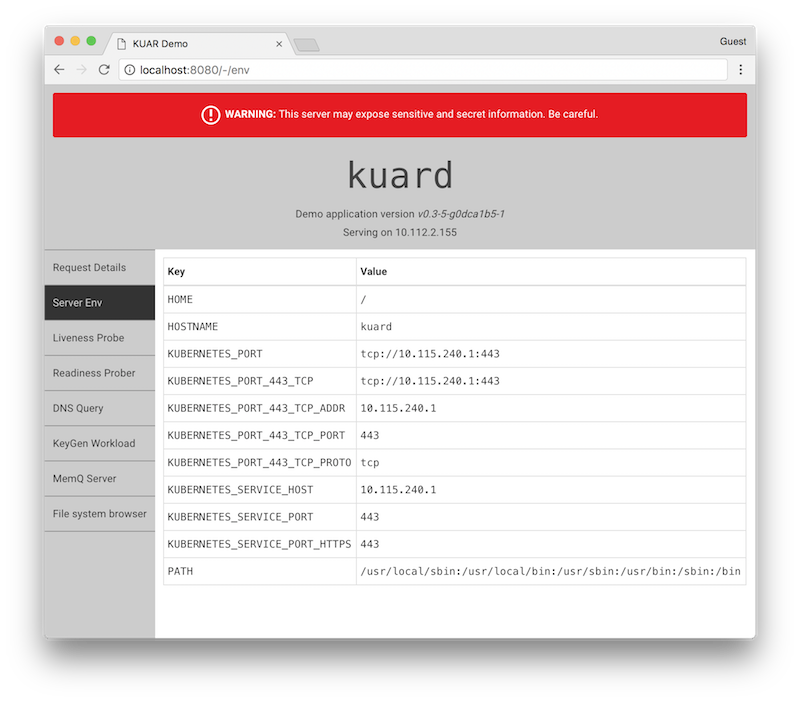

# Demo application for "Kubernetes Up and Running"



### Running

```
kubectl run --restart=Never --image=gcr.io/kuar-demo/kuard-amd64:1 kuard
kubectl port-forward kuard 8080:8080
```

Open your browser to [http://localhost:8080](http://localhost:8080).

### Building

#### Automated container build and push

This will build and push container images to a registry.
It uses gcloud to push to GCR by default.  You can edit `rules.mk` to change this.

This builds a set of images with "fake versions" to be able to play with upgrades.

```
make push REGISTRY=<my-gcr-registry>
```

#### Manual docker build

For those following along with the book, you can build a binary to include in a docker image with a simple `make build`.  This will drop a `kuard` binary into `bin/1/amd64`.

You can then build a docker image with the following Dockerfile:

```
FROM alpine
COPY bin/1/amd64/kuard /kuard
ENTRYPOINT ["/kuard"]
```

Then build with docker with something like `docker build -t kuard-amd64:1 .`

### KeyGen Workload

To help simulate batch workers, we have a synthetic workload of generating 4096 bit RSA keys.  This can be configured through the UI or the command line.

```
--keygen-enable               Enable KeyGen workload
--keygen-exit-code int        Exit code when workload complete
--keygen-exit-on-complete     Exit after workload is complete
--keygen-memq-queue string    The MemQ server queue to use. If MemQ is used, other limits are ignored.
--keygen-memq-server string   The MemQ server to draw work items from.  If MemQ is used, other limits are ignored.
--keygen-num-to-gen int       The number of keys to generate. Set to 0 for infinite
--keygen-time-to-run int      The target run time in seconds. Set to 0 for infinite
```

### MemQ server

We also have a simple in memory queue with REST API.  This is based heavily on https://github.com/kelseyhightower/memq.

The API is as follows with URLs being relative to `<server addr>/memq/server`.  See `pkg/memq/types.go` for the data structures returned.

| Method | Url | Desc
| --- | --- | ---
| `GET` | `/stats` | Get stats on all queues
| `PUT` | `/queues/:queue` | Create a queue
| `DELETE` | `/queues/:queue` | Delete a queue
| `POST` | `/queues/:queue/drain` | Discard all items in queue
| `POST` | `/queues/:queue/enqueue` | Add item to queue.  Body is plain text. Response is message object.
| `POST` | `/queues/:queue/dequeue` | Grab an item off the queue and return it. Returns a 204 "No Content" if queue is empty.

### Versions

Images built will automatically have the git verison (based on tag) applied.  In addition, there is an idea of a "fake version".  This is used so that we can use the same basic server to demonstrate upgrade scenarios.

Right now we create 3 fake versions: `1`, `2`, and `3`.  This translates into the following container images:

```
gcr.io/kuar-demo/kuard-amd64:v0.4-1
gcr.io/kuar-demo/kuard-amd64:1
gcr.io/kuar-demo/kuard-amd64:v0.4-2
gcr.io/kuar-demo/kuard-amd64:2
gcr.io/kuar-demo/kuard-amd64:v0.4-3
gcr.io/kuar-demo/kuard-amd64:3
```

For documentation where you want to demonstrate using versions but use the latest version of this server, you can simply reference `gcr.io/kuar-demo/kuard-amd64:1`.  You can then demonstrate an upgrade with `gcr.io/kuar-demo/kuard-amd64:2`.

(Another way to think about it is that `:1` is essentially `:latest-1`)

We also build versions for `arm`, `arm64`, and `ppc64le`.  Just substitute the appropriate architecture in the image name.  These aren't as well tested as the `amd64` version but seem to work okay.

### Development

If you just want to do Go server development, you can build the client as part of a build `make`.  It'll drop the result in to `sitedata/built/`.

If you want to do both Go server and React.js client dev, you need to do the following:

1. Have Node installed
2. In one terminal

  * `cd client`
  * `npm install`
  * `npm start`
  * This will start a debug node server on `localhost:8081`.  It'll proxy all unhandled requests to `localhost:8080`

3. In another terminal
  * Ensure that $GOPATH is set to the directory with your go source code and binaries + ensure that $GOPATH is part of $PATH.
  * `go get -u github.com/jteeuwen/go-bindata/...`
  * `go generate ./pkg/...`
  * `go run cmd/kuard/*.go --debug`
4. Open your browser to http://localhost:8081.

This should support live reload of any changes to the client.  The Go server will need to be exited and restarted to see changes.

### Makefiles

Go building makefiles taken from
https://github.com/thockin/go-build-template with an Apache 2.0 license.
Handling multiple targets taken from https://github.com/bowei/go-build-template.

These have been heavily modified.
* Support explicit docker volume for caching vs. using host mounts (as they are really slow on macOS)
* Building/caching node
* Fake versions so we can play with upgrades of this server

### TODO
* [ ] Make file system browser better.  Show size, permissions, etc.  Might be able to do this by faking out an `index.html` as part of the http.FileSystem stuff.
* [ ] Clean up form for keygen workload.  It is too big and the form build doesn't have enough flexibility to really shrink it down.
